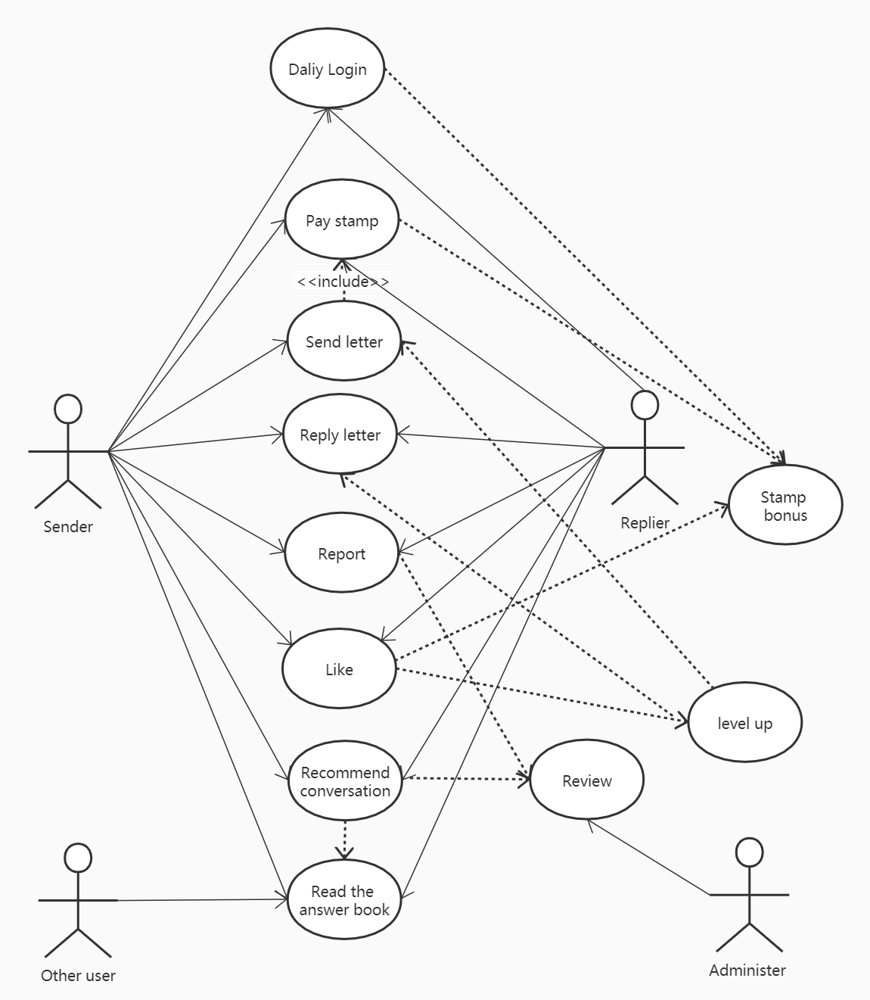
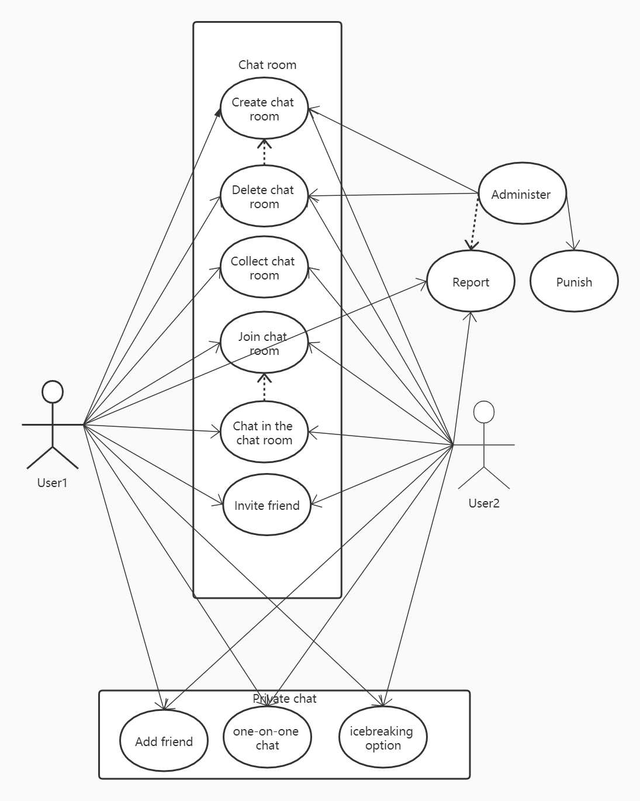

# Final project of Kaixiang Ma 

## A strangers chat app for emotional healing and personal growth.
## Acceptance criteria
The user stories marked with the emoticon 🔥 are interesting ideas other similar stranger chat apps don't have.
### 1. Anonymous letter to solve troubles.

**As a sender, I hope to share and consult my troubles with strangers through anonymous letters and keep in touch with them on this topic.**

- Provide a function to send anonymous letter randomly.
- A list shows the conversations I started, a list shows the conversations I replied to
- Each conversation shows the signature of the other person, the number of correspondence, and the latest reply time.
- Provide options to continue replying/ delete conversations
- Show error message if service not responding or timeout. 

**I hope that writing a letter needs to consume stamps, which is close to the feeling of writing letters.**

- Consume a stamp when sending a letter, except the first reply of the conversation. 
- Show error message if there is no stamps left or forget to select stamp.
- A stamp collection folder displays a list of existing stamps, total number of stamps

**🔥 I hope there are interesting rules for the use of stamps to make the app more interesting.**

- Slow messaging for ordinary stamp—— a three-hour delay(close to the feeling of writing letters)
- Different kind of stamp: ordinary stamp、accelerated stamp(instant messaging)、super stamp(no need to pay stamp for this conversation)
- Daily login bonus: 1-7 free ordinary stamp, 0-2 accelerated stamp. 
- Aperiodic activities Award: a super stamp.

**I want a level up rules to make the app more interesting and not be disturbed by too many letters  and consultations.**

- Show user's level and corresponding maximum number of letters will be received everyday and maximum letters to be reply everyday, exclude conversations already existed which only consume stamp, and every day free stamp of each level.
- Show all levels and corresponding privilege.
- New letters, consultations exclude conversations already existed, are automatically updated once every day, display the update countdown.
- Display reply chances left today. Show error message if reply but there is no chance.
- Display the 'SEE MORE' button at the bottom of the list of new letters, which will direct to The Book of Answers.

**🔥 I want to see other people's high-quality consultations and answers, which may solve my troubles.**

- The Book of Answers shows high quality conversations by topics: like Self / Family / Campus/ Love /Marriage/  Friendship / Social / Workplace / Disease / Psychology and so on
- Recommend option in the conversation. Click recommend, then select the topic, the other person in the conversation will receive a recommendation request.
- Agree/Refuse recommendation. Corresponding notification to the recommender. 
- Choose to agree, show message: After passing the audit, your conversation will be collected in the book of answers, and you will get bonus stamps and EXP.
- Administer platform shows list of recommendation requests. Approve/refuse/bonus/change topic and send corresponding notifications to both people of the conversation.
- Like👍/Collect⭐ option for the conversation in the  book of answers. Each like/collect with a bonus EXP.

**I want to give feedback on the quality of the incoming letter and reply letter.** 

- Like👍 option for the letter. Each like will add an EXP to the sender.
- Report option with comments. (For lewd or harassing, junk and any unfriendly content).
- Administer system shows list of reports. Approve/Deduct EXP/Suspend/Freeze option. 
- Notify the outcome of report to both people of the conversation.

### UML Use case diagrams for this part:

### 2. Instant chat, share this moment together.

**As a user who prefers instant chat, I want to set up temporary themed chat rooms based on my current mood or current topics of interest and chat with strangers who have same mood or interested with the same topic.**

- Create/Join/Exit/Collect chat rooms.

- Delete/Modify chat rooms(creator 's authority).

- Send instant messages in the chat room.

- Display the list of members in the chat room now. Display messages of new members joining/exiting.

- Delete chat history when exiting.

- Report option with comments. (For lewd or harassing, junk and any unfriendly content).

  

**I want to add friends in the chat room and be able to chat with friends at any time.**

- Send a friend request/Block somebody
- Approve/Refuse friend request
- Friends List
- Send instant messages
- New message notification
- Report option with comments. (For lewd or harassing, junk and any unfriendly content)

**🔥 As a person not good at communication, I want the app helps me break the ice with my new friends.**

- Turn on icebreaking option in the chat window with a friend.
- Push an icebreaker question/topic for both people every day.
- Feedback for icebreaker: Useful/Useless/I have better icebreaker.

**🔥 I hope there are some chat rooms for hot topics (Movies / Series / Musics / Games / Stocks / News) created by the system, where friends can be invited to chat in this chat room for this topic.**

- Create/Delete/Modify chat rooms in administer platform.
- Invite friends to join the chat room.
- Invitation notification.
- Approve / Refuse join the chat room.
- Show error message if the chat room has been deleted.

Optional: The higher the level of the creator, the longer the chat room will last or the higher level, the more chat rooms can be created in a single month 

 ### UML Use case diagrams for this part

